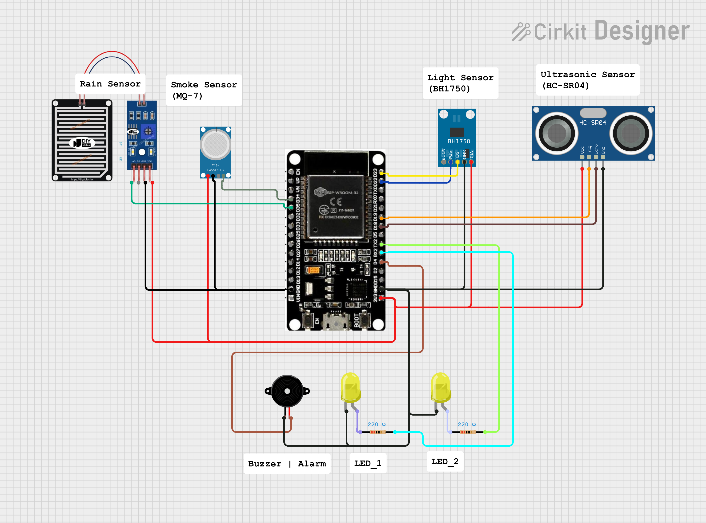
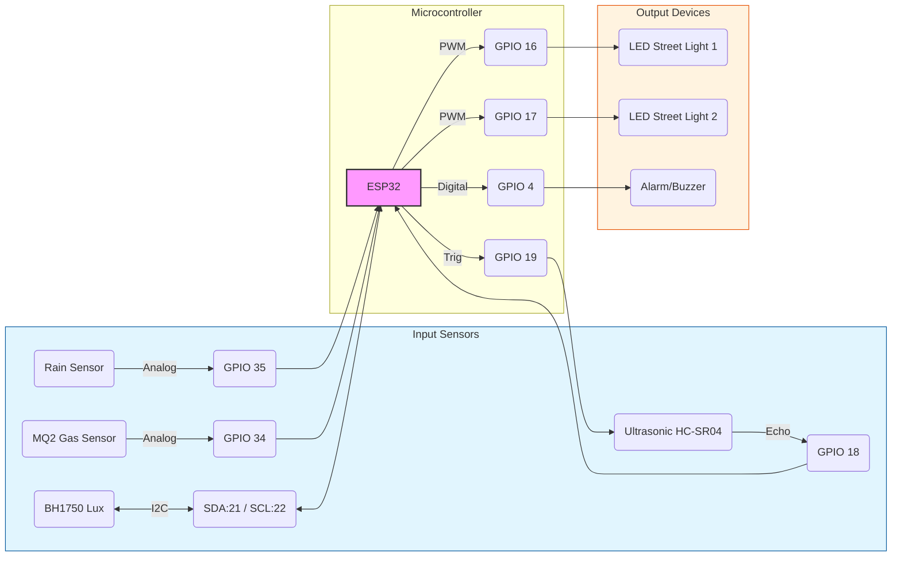

<div align="center">

# 💡 IoT Smart Light Dashboard

**Sistem Monitoring dan Kontrol Penerangan Jalan Umum (PJU) Pintar Berbasis ESP32**


</div>

---

## 📖 Deskripsi

Dashboard berbasis web untuk memantau dan mengontrol sistem **Penerangan Jalan Umum (PJU) Pintar** berbasis IoT. Proyek ini memanfaatkan **Firebase Realtime Database** untuk sinkronisasi data sensor (cahaya, hujan, lalu lintas) dan kontrol lampu secara _real-time_ dengan latensi rendah.

### ✨ Fitur Utama

-   📊 **Real-time Monitoring:** Memantau intensitas cahaya (Lux), status hujan, dan kepadatan lalu lintas.
-   🎛️ **Dual Mode Control:**
    -   **Otomatis:** Lampu menyesuaikan sendiri berdasarkan input sensor.
    -   **Manual:** Kontrol intensitas lampu (PWM) menggunakan slider via dashboard.
-   ⚡ **Power Estimator:** Estimasi penggunaan daya (Watt) berdasarkan output lampu.
-   📝 **Log Aktivitas:** Tabel riwayat data sensor yang terupdate otomatis.
-   🔐 **Sistem Login:** Keamanan akses dashboard menggunakan Firebase Authentication.

## 📂 Struktur Folder

Repository ini dipisahkan menjadi dua bagian utama untuk memudahkan pengembangan:

````text
root/
├── 📂 firmware/                      # Kode C++ untuk ESP32
│   ├── 📜 ESP32-IoT-FlashCode.ino
│   └── 📜 esp_config.h               # Konfigurasi Kredensial (WiFi & API)
│
└── 📂 web-dashboard/                 # Interface Website
│    ├── 📜 dashboard.html
│    ├── 📜 analytics.html
│    ├── 📜 settings.html
│    └── 📜 config.js                  # Konfigurasi Firebase Web SDK
│
├── 📄 circuit-schematic-diagram.png  # Diagram Wiring
├── 📄 README.md                      # Dokumentasi Proyek

````

## 🛠️ Hardware & Wiring

Bagian ini menjelaskan bagaimana komponen-komponen terhubung ke mikrokontroler ESP32.

### 1. Diagram Skematik


### 2. Alur Koneksi (Logic View)
Berikut adalah visualisasi logika koneksi antar komponen menggunakan ESP32:


### 3. Tabel Pinout (Mapping)

| Pin ESP32 | Komponen | Keterangan |
| :---: | :--- | :--- |
| **GPIO 04** | Buzzer | Output Digital |
| **GPIO 16** | LED 1 | Output PWM |
| **GPIO 17** | LED 2 | Output PWM |
| **GPIO 18** | Ultrasonic Echo | Input Sensor |
| **GPIO 19** | Ultrasonic Trig | Output Sensor |
| **GPIO 21** | BH1750 (SDA) | Komunikasi I2C |
| **GPIO 22** | BH1750 (SCL) | Komunikasi I2C |
| **GPIO 34** | Sensor MQ2 | Input Analog |
| **GPIO 35** | Sensor Hujan | Input Analog |

---

### 4. Instalasi & Konfigurasi

## 🚀 Cara Instalasi & Menjalankan

> [!WARNING]
> Karena proyek ini menggunakan **ES Modules** (`import/export`), Anda **tidak bisa** membuka file HTML dengan cara *double-click*. Wajib menggunakan Local Server.

### 1. Clone Repository
Download source code proyek ini ke komputer Anda atau gunakan git:
```bash
git clone [https://github.com/KhrisnaWahyu/IoT-AdaptiveStreetLighting.git]

### 2. Konfigurasi Web Dashboard (`config.js`)
Agar dashboard dapat terhubung ke database Anda sendiri:

1.  Buka file bernama `web-dashboard/config.js` di dalam folder proyek.
2.  Masukkan kredensial API Key  dari Firebase Console: 

    ```javascript
    export const firebaseConfig = {
        apiKey: "MASUKKAN_API_KEY_ANDA_DISINI",
        authDomain: "project-id.firebaseapp.com",
        databaseURL: "[https://project-id.firebaseio.com](https://project-id.firebaseio.com)",
        projectId: "project-id",
        appId: "app-id"
    };
    ```
    > ⚠️ **Catatan:** File `config.js` sudah dimasukkan ke dalam `.gitignore` agar kunci rahasia Anda tidak ikut ter-upload ke GitHub publik.

### 3. Konfigurasi Keamanan (`esp_config.h`)
Agar ESP32 dapat terhubung ke WiFi dan Firebase:

1.  Buka file `firmware/esp_config.h`.
2.  Buka file `esp_config.h` tersebut, Masukkan kredensial WIFI Information dan API Key dari Firebase Console Anda:

    ```javascript
    // firmware/esp_config.h
        #define SECRET_WIFI_SSID "NAMA_WIFI_ANDA"
        #define SECRET_WIFI_PASS "PASSWORD_WIFI_ANDA"

        #define SECRET_API_KEY   "API_KEY_FIREBASE"
        #define SECRET_DB_URL    "URL_DATABASE_FIREBASE"

        #define SECRET_EMAIL     "admin@project.com" // Email User Auth
        #define SECRET_PASS      "admin123"          // Password User Auth
    ```
    > ⚠️ **Catatan:** File `esp_config.h` sudah dimasukkan ke dalam `.gitignore` agar kunci rahasia Anda tidak ikut ter-upload ke GitHub publik.
    

### 4. Menjalankan Dashboard
Gunakan ekstensi **Live Server** di VS Code atau server lokal lainnya (seperti Python SimpleHTTPServer atau Node http-server).

* **Via VS Code:** Klik kanan pada file `dashboard.html` lalu pilih **"Open with Live Server"**.
* Akses di browser: `http://127.0.0.1:5500/dashboard.html`

## 🔐 Akun Login (Demo)

Jika Anda menggunakan database default atau ingin mencoba tampilan UI, gunakan kredensial berikut (pastikan akun ini sudah dibuat di Firebase Authentication menu):

| Field | Value |
| :--- | :--- |
| **Email** | `admin@gmail.com` |
| **Password** | `admin123` |

## 🛠️ Teknologi yang Digunakan

* **Frontend:** HTML5, CSS3 (Custom Design), JavaScript (ES6 Modules).
* **Backend:** Firebase Realtime Database & Firebase Authentication.
* **Library:** Chart.js (untuk visualisasi grafik).
* **Hardware (Target):** ESP32, Sensor LDR, Sensor Hujan, & LED Driver (PWM).

---
<div align="center">

Created by:


Azkal Azkiya Alfiandri • Khrisna Wahyu Wibisono • Lutfia Rahmah Tunnisa


📅 December 2025


© 2025 IoT Smart Light Project.

</div>

